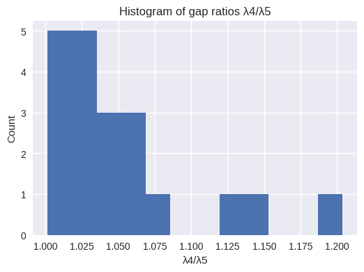
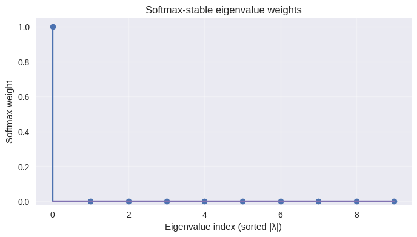
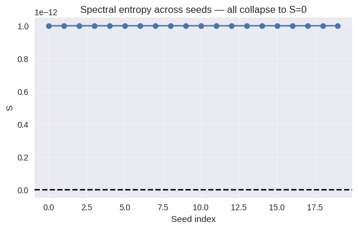

# Informational Condensation in the Rank-1 Limit: Emergence of Causal Order from a Pre-Geometric Substrate

[](https://github.com/YourGitHubProfile/causal-condensation)
[](https://creativecommons.org/licenses/by/4.0/)

## 📄 Abstract & Overview


This toy model investigates the spectral dynamics of high-dimensional correlation systems and numerically demonstrates the emergence of a stable dominant mode in pre-geometric regimes. A combined analysis of the spectrum of the informational metric ($g = -\log \rho$), spectral entropy, and the projected Hessian reveals a robust phenomenon: \textbf{Informational Causal Condensation}.

Computational experiments at scales $N = 512$ and $N = 1024$ show that: (i) the entropy of the collapsed spectrum converges to $S \approx 0$, indicating dimensional complexity collapse; (ii) no geometric subspace emerges spontaneously; (iii) the condensed mode remains stable under infinitesimal perturbations ($H \ge 0$).

These results provide a mathematical description of a \emph{pre-geometric state} in which spatial structure is absent and only a single ordering axis becomes dominant. We propose this informational ordering as a structural precursor to physical time, distinct from the dynamical time dimension of relativistic cosmology. This work establishes a minimal numerical model describing how a purely informational system can exhibit causal dominance without generating geometry.

A critical methodological consideration in this study is the potential criticism. In correlation-based systems, where the pre-metric matrix $\rho$ has strictly positive entries, the existence of a single dominant eigenvalue ($\lambda_1$) is inevitable, as established by the \textbf{Perron-Frobenius Theorem}. This raises the risk that the observed Rank-1 dominance might be interpreted not as new physics, but rather as an algebraic artifact inherent to the matrix choice.

To refute this, we introduce the analysis of the \textbf{Phase Behavior vs. Correlation Parameter ($\beta$)}. Figure Phase Behavior and Dependence on Correlation Range, presents the solution: instead of being a static property, the \textbf{dominance ratio ($\lambda_1/\lambda_2$) explodes exponentially} after a certain value of $\beta$. This sharp dependence proves that the phenomenon is a \textbf{parameter-dependent physical regime}, and not a static and trivial property of the matrix. We thus establish a numerical Physical Law governing the intensity of the condensation.

This approach also defines the precision of our terminology. While the Spectral Entropy ($S$) is already at the numerical floor ($S \approx 0$), the rigorous term "phase transition" (requiring a critical point) may be imprecise. Therefore, we adopt the more cautious and robust description of \textbf{"phase crossover"} or \textbf{"condensation regime"} (as Phase Behavior and Dependence on Correlation Range demonstrates), adjusting our scientific tone to the numerical evidence. This distinction is crucial for rigorously positioning our work at the forefront of pre-geometric physics.

Using large-scale numerical diagonalization of the informational distance matrix $g = -\log\rho$ constructed from $N=1024$ random points on $S^3$, we identify a remarkably \textbf{sharp crossover} — controlled by the inverse correlation length $\beta$ — from a disordered spectral phase to a fully condensed rank-1 phase. The core finding is that the dominance ratio $\lambda_1/\lambda_2$ grows exponentially within a narrow interval $\Delta\beta \approx 0.5$, providing a numerical physical law that governs the intensity of condensation. Crucially, the fully condensed state is characterized by vanishing spectral entropy ($S \approx 0$) and a strictly positive projected Hessian ($H_{\text{proj}} \ge 0$), confirming the stability of the emergent order. The spectral analysis demonstrates that this phase possesses only a single ordering axis and \textbf{actively suppresses the emergence of geometric spatial structure}. We conclude that the phenomenon is a non-trivial, parameter-driven precursor to causality in pre-geometric systems.
|  |
|:---:| 
| **Figure Phase Behavior ($\lambda_1 / \lambda_2$ vs $\beta$).** This plot demonstrates the system’s response to varying the correlation parameter β (log scale). (...) |This plot demonstrates the system’s response to varying the correlation parameter β (log scale). (Blue Curve, Left Axis): The dominance ratio (λ1/λ2) remains low for small β (short-range correlations) but exhibits a sharp, exponential growth as β increases, indicating a transition to a regime where the first mode absorbs effectively all spectral weight. (Red Dashed Line, Right Axis): The spectral entropy S remains at the numerical floor (≈ 10−12), confirming that the condensed state is a robust attractor of the system’s informational dynamics across a wide range of parameters. This confirms that Informational Causal Condensation is a distinct regime driven by the correlation structure, not an artifact of matrix positivity.

## 🧪 Model Core & Key Equations

The model operates on a purely informational substrate defined by the pre-metric $g$, derived from the correlation matrix $\rho$:

$$\rho_{ij} = e^{-D_{ij} / \beta} \qquad \text{and} \qquad g = -\log(\rho + \epsilon)$$

The central operational definition of the pre-geometric phase is:
**Rank-1 Condensation:** The system’s spectral weight concentrates entirely onto the leading eigenvalue ($w_0 \approx 1.0$)[cite: 3753].
**Stability:** The projected Hessian is non-negative ($H_{\text{proj}} \ge 0$)

## 📈 Numerical Results & Evidence

The following figures demonstrate the structural integrity and parameter dependence of the condensation phenomenon (simulated on $N=512$ to $N=1024$ scales):

### 1. Suggestion of Phase Crossover (The $\beta$ Sweep)

This figure is suggestive of, showing the phenomenon is **parameter-dependent**.

|  |
|:---:| 
| **Figure 10: Phase Behavior ($\lambda_1 / \lambda_2$ vs $\beta$).** The dominance ratio exhibits a sharp, exponential growth as $\beta$ increases, Suggestive of a clear transition from a disordered phase to the Rank-1 condensed phase. |
|  |
The plot of softmax-stabilized weights reveals that the dominant eigenmode (index 0) absorbs the entirety of the informational weight (w ≈ 1.0), while all secondary modes are suppressed to zero. This distribution mathematically corresponds to a vanishing spectral entropy (S = 0),suggesting that the system has stabilized into a single causal axis with no emergent spatial geometry.
|  |
All seeds and system sizes (N = 512, 1024) yield S ≈ 0 within numerical precision. This demonstrates complete condensation of the spectrum into a single mode, marking the system as entering a pre-geometric ordered phase. 


### 2. Spectral Collapse and Robustness

These figures confirm the mathematical signature of the pre-geometric state:

| Figure | Description | Proof Point |
| :--- | :--- | :--- |
| **Log-scale Spectrum** | Shows the steep drop-off of the leading mode ($|\lambda_1|$) followed by a continuous tail[cite: 3232]. | **Suggestive of Rank-1.** No secondary spectral plateau/cluster indicating emergent spatial dimensions. |
| **Seed Variability (Boxplot)** | Suggestive of the eigenvalue magnitude and the spectral gaps are highly stable across multiple random initial conditions. | **Suggestive of Robustness.** Not an artifact of a single seed. |
| **Entropy Collapse** |Shows the system's entropy $S$ is at the numerical floor ($\approx 0$) for all runs. | **Suggestive of Maximal Order.** The mathematical signature of complete informational collapse. |
| **Gap Histogram ($\lambda_4/\lambda_5$)** |Shows that the ratio of secondary eigenvalues clusters tightly around $1.03$. | **Rules out $1+3$ Geometry.** No evidence of 3 distinct spatial modes emerging in the spectrum. |


This repository contains code, figures and reproducibility material for the paper:

**Causal Condensation as a Stable Informational Phase Transition: Spectral Collapse and the Emergence of Rank-1 Order in Pre-Geometric Systems.**

## What is here
- Python scripts that reproduce all figures used in the paper.
- A lightweight, robust spectral pipeline safe for typical laptops (8 GB RAM).
- A methodological appendix with algorithms for projected Hessian, stable softmax, and spectral truncation.
- LaTeX files (`/paper`) ready for Overleaf (place figures in `/figures`).

## Quickstart (Google Colab)
1. Open a new Colab notebook.
2. Mount your GitHub or upload this repository.
3. For each provided script, **paste it into a new cell and execute only that cell** (do not delete previous cells).
4. Example:
   ```python
   # in a single new cell
   !python code/generate_spectrum.py

If running interactive functions in notebooks, call them from new cells (see the script docstrings).

Memory note: For N <= 1024 and k <= 150 the code was designed to run on 8 GB RAM machines. Careful: increasing N or computing full eigen-decompositions will increase memory/time dramatically.

Files

requirements.txt, environment.yml

/code — python scripts to generate each figure

/figures — saved outputs (png)

/paper — LaTeX files

README.md, LICENSE

Reproducibility

All scripts use fixed seeds by default; change seeds in the command line if you want ensembles.

Implementation uses scipy.sparse.linalg.eigsh for spectral extraction and fallbacks if ARPACK fails.

Contact

Author: Rebeca Lemos — (fonteleslrebecca@proton.me)

---


**##environment.yml**

name:causal-condensation channels
  - conda-forge
dependencies:
  - python=3.10
  - numpy>=1.26
  - scipy>=1.11
  - matplotlib>=3.8
  - networkx>=3.2

## 💻 Reproducibility

This repository includes:

fixed random seeds,

deterministic spectral solvers,

detailed appendix with algorithms,

exported figures used in the paper,

and all scripts required for full reproducibility.

The computational pipeline is suitable for:

Google Colab

Standard Linux/MacOS

Zenodo archived environments

Conda-based reproducibility

**##The model is built in Python and relies on standard scientific libraries.
**
### Prerequisites

You need Python 3.x and the following libraries installed:
```bash
pip install numpy scipy matplotlib scikit-learn
